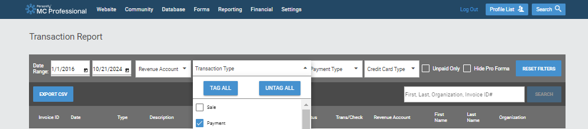

# Analysis workflow for institution and representative membership tracking in MemberClicks

## Retrieval of transaction report in MemberClicks (MC)

The transaction export is the main input to this pipeline and is generated through the [CUAHSI administrator account](https://cuahsi.memberclicks.net/administrator#/login). When in MemberClicks, go to Finanical --> Transaction Report, and then change the start date to January 1, 2016 (the end date will automatically be set to the current day). Before exporting, ensure that only `Payments` are selected under the `Transaction Type` (by default `Sale`, `Refund`, `Payments` and `Settlements` are toggled). Below is an example of what your query in MC should look like before exporting.

When the transaction data is ready to be exported, click 'Export CSV', rename the transaction report to YYMMDD_transaction_report.csv (where YYMMDD is the date when the export was created), and store this file in [2_clean/src/in](2_clean/src/in) prior to starting the analysis workflow.

## Execution of analysis workflow

This data analysis workflow uses Snakemake (installation instructions [here](https://snakemake.readthedocs.io/en/stable/getting_started/installation.html)) as a pipelining tool for this analysis workflow. Note that the login credentials (stored in an .env file in the root of this directory) are required to run this workflow and are available to [Authorized Service Administrators (ASAs)](https://help.memberclicks.com/hc/en-us/articles/21827273754125-Authorized-service-administrators-ASAs) through the Account Settings page in MC. 

In the top of [Snakefile](Snakefile.smk), set the `transaction_export_date` equal to the date when the transaction export was created , and set the `profile_export_date` to today's date (both as strings and in YYMMDD format). The profile information is pulled directly from MC in this workflow.

To run the pipeline, first create a Conda environment with all the required packages by running the following command: `conda env create -f environment.yaml`

Then we can go into the new environment with the following command: `conda activate membership-analysis-workflow`

Once in the new environment, we can execute the snakemake pipeline with this command: `snakemake --cores 1 -s Snakefile.smk`. A DAG of the workflow can be found [here](dag.png).

When the jobs are done, the following output files are useful for inspection and dissemination: 
- A heatmap of showing payments across institutions over time spread through 2028 in a newly created `out` folder in [05_visualize_transactions](05_visualize_transactions) 
    - The same payment data is also in a CSV in a newly created `out` folder in [04_process_transactions](04_process_transactions)
- Two CSV files of representatives from both active and lapsed institutions in a newly created `out` folder in [07_munge_representatives](07_munge_representatives)

